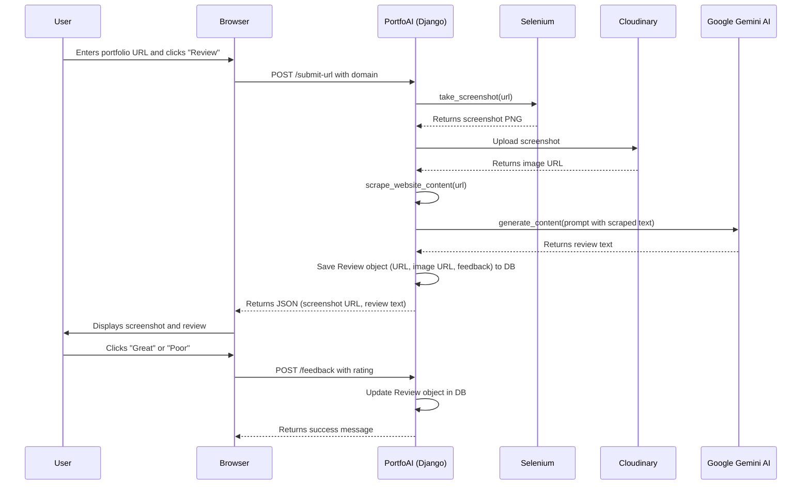

video link :   https://drive.google.com/file/d/1XO-ZtyYGPMFhP_Lhog8hG16H5jkQbXBy/view
# PortfoAI: AI-Powered Portfolio Reviewer

PortfoAI is a Django-based web application designed to provide automated, AI-powered reviews of portfolio websites.

## Core Functionality

1.  **URL Submission:** Users submit a portfolio URL through a simple web interface.
2.  **Automated Analysis:** The backend processes the URL by:
    *   Taking a full-page screenshot of the website using **Selenium**.
    *   Uploading the screenshot to **Cloudinary** for hosting.
    *   Scraping key text content from the website's HTML using **BeautifulSoup**.
3.  **AI-Powered Review Generation:** The scraped text is sent to **Google's Gemini AI model** with a prompt to generate a professional review focusing on design, project showcases, and navigation.
4.  **Display and Feedback:** The application displays the screenshot and the AI-generated review to the user. The user can then provide feedback on the quality of the review ("great" or "poor").

## Project Architecture Diagram



## Technical Stack

*   **Backend:** Django
*   **Frontend:** HTML, Tailwind CSS, and vanilla JavaScript
*   **Database:** Configured with SQLite by default.
*   **Key Libraries:**
    *   `django`: Web framework
    *   `google-generativeai`: For interacting with the Gemini AI model.
    *   `selenium` & `beautifulsoup4`: For web automation and scraping.
    *   `cloudinary`: For cloud-based image management.
    *   `python-dotenv`: For managing environment variables.

## Setup and Installation

1.  **Clone the repository:**
    ```bash
    git clone https://github.com/jamilEmon/PortfoAI.git
    cd PortfoAI
    ```

2.  **Create a virtual environment and install dependencies:**
    ```bash
    python -m venv venv
    source venv/bin/activate  # On Windows, use `venv\Scripts\activate`
    pip install -r requirements.txt
    ```

3.  **Set up environment variables:**
    Create a `.env` file in the project root and add the following keys:
    ```
    DJANGO_SECRET_KEY='your-django-secret-key'
    CLOUDINARY_CLOUD_NAME='your-cloudinary-cloud-name'
    CLOUDINARY_API_KEY='your-cloudinary-api-key'
    CLOUDINARY_API_SECRET='your-cloudinary-api-secret'
    GOOGLE_API_KEY='your-google-api-key'
    ```

4.  **Run database migrations:**
    ```bash
    python manage.py migrate
    ```

5.  **Run the development server:**
    ```bash
    python manage.py runserver
    ```
    The application will be available at `http://127.0.0.1:8000/`.
